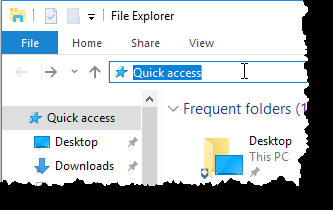
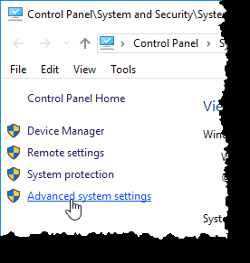
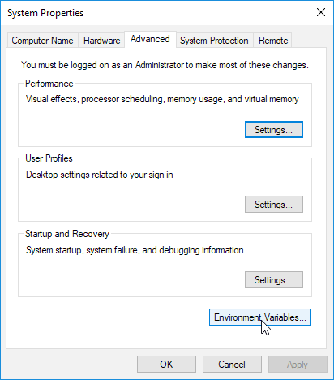
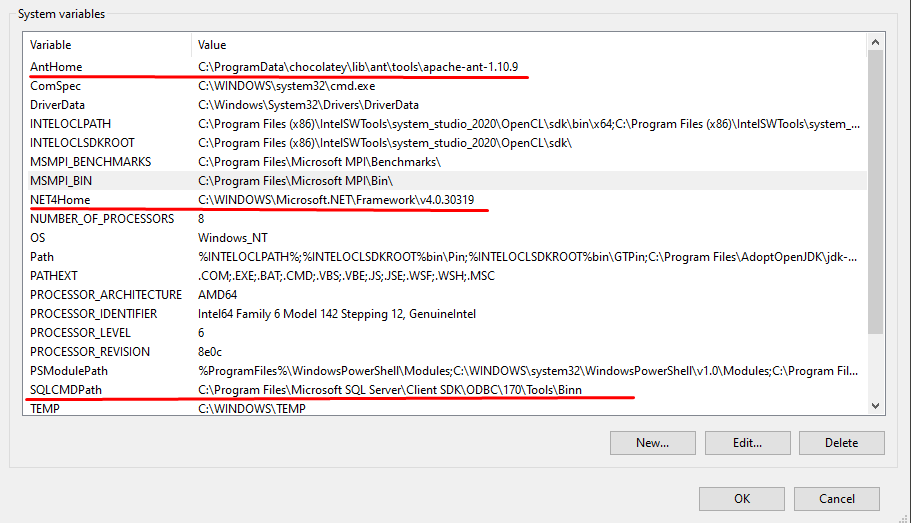
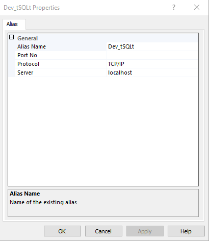
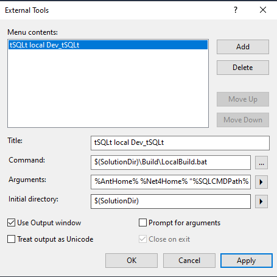
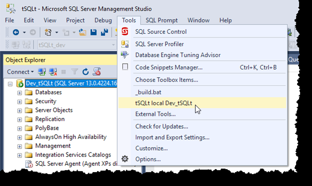

# Install the tSQLt build
## Software pre-requisites
In order to be able to run the build and automated tests locally, you need to install following software:
* [Microsoft .NET Framework 3.5 Service Pack 1](https://www.microsoft.com/en-us/download/details.aspx?id=22)
* [.NET Framework 4.8 Developer](https://dotnet.microsoft.com/download/dotnet-framework/thank-you/net48-developer-pack-offline-installer)
* [sqlcmd](https://docs.microsoft.com/en-us/sql/tools/sqlcmd-utility?view=sql-server-ver15) (comes with SQL Server, so needed to be installed if only it is not installed)
* Java: [Oracle](https://www.oracle.com/java/technologies/javase-jre8-downloads.html) or [Openjdk](https://openjdk.java.net/install/) (`choco install openjdk11`). It is needed for running *Ant* builds only
* [Ant](https://ant.apache.org/bindownload.cgi) (`choco install ant`)
* [git](https://git-scm.com/downloads) (`choco install git`)
* [SSMS](https://docs.microsoft.com/en-us/sql/ssms/download-sql-server-management-studio-ssms?view=sql-server-ver15)

## Instructions
1. Set system environment variables. You can do it either in command prompt (elevated mode is needed)
>  Paths given as example, change it to the valid locations

>  Trailing slashes are not allowed
```
setx AntHome "%PROGRAMDATA%\chocolatey\lib\ant\tools\apache-ant-1.10.9" /M
setx NET4Home "%WINDIR%\Microsoft.NET\Framework\v4.0.30319" /M
setx SQLCMDPath "%PROGRAMFILES%\Microsoft SQL Server\Client SDK\ODBC\170\Tools\Binn" /M
```
or 
* Open File Explorer window (<kbd>WinKey</kbd> + <kbd>E</kbd>)
* Click on the Path Bar (behind the current path, not on) or <kbd>Alt</kbd> + <kbd>D</kbd>

    
* Type in `Control Panel\System and Security\System`
* Hit <kbd>Return</kbd>
* Select *Advanced system settings*

    

* Click on *Environment Variables…* button

    

* Create 3 new system variables (note that paths should exist, you might need to change them for your setup)

    | Variable | Value |
    |----------|-------|
    | AntHome | "%PROGRAMDATA%\chocolatey\lib\ant\tools\apache-ant-1.10.9" |
    | NET4Home | "%WINDIR%\Microsoft.NET\Framework\v4.0.30319" |
    | SQLCMDPath | "%PROGRAMFILES%\Microsoft SQL Server\Client SDK\ODBC\170\Tools\Binn" |

    

2. Enable TCP connection on SQL Server Instance. [Follow this instructions](https://docs.microsoft.com/en-us/sql/database-engine/configure-windows/enable-or-disable-a-server-network-protocol?view=sql-server-ver15)
3. Create instance alias `Dev_tSQLt` to `localhost` (optional). You can use either `Sql Server Configuration Manager` or TCP alias in `cliconfig.exe` (`C:\Windows\SysWOW64\cliconfig.exe`, `C:\Windows\System32\cliconfig.exe`)
    * Open *Sql Server Configuration Manager*
    * Navigate to *SQL Native Client 11.0 Configuration --> Aliases* and/or  *SQL Native Client 11.0 Configuration (32bit) --> Aliases* (you can add them both if you are not sure)
    * Fill `Dev_tSQLt` as *Alias Name* and port if it is not default one

    

4. git clone [tSQLt Sources](https://github.com/tSQLt-org/tSQLt) `https://github.com/tSQLt-org/tSQLt.git`
5. If you do not have access to the original key (probably not), create self-signed key without password, using [Strong Name Tool (sn.exe)](https://docs.microsoft.com/en-us/dotnet/framework/tools/sn-exe-strong-name-tool). You can run [.\tSQLtCLR\OfficialSigningKey\InstallSigningKey.bat](../tSQLtCLR/OfficialSigningKey/InstallSigningKeyNoPassword.bat)
    * cd [.\tSQLtCLR\OfficialSigningKey](../tSQLtCLR/OfficialSigningKey)
    * copy tSQLtOfficialSigningKey.pfx tSQLtOfficialSigningKey.pfx_backup
    * "C:\Program Files (x86)\Microsoft SDKs\Windows\v10.0A\bin\NETFX 4.8 Tools"\sn.exe -k tSQLtOfficialSigningKey.pfx
    * Run [.\tSQLtCLR\OfficialSigningKey\InstallSigningKey.bat](../tSQLtCLR/OfficialSigningKey/InstallSigningKey.bat) file
    * InstallSigningKey.bat
6. Re-start SSMS (if it was open)
7. Go to `Tools --> External Tools`, tick `Use Output Window` and fill:
    | Property | Value |
    |------|------|
    | Title | tSQLt local Dev_tSQLt |
    | Command | $(SolutionDir)\Build\LocalBuild.bat |
    | Arguments | %AntHome% %Net4Home% "%SQLCMDPath%" Dev_tSQLt tSQLt_dev |
    | Initial directory | $(SolutionDir) |
    

8. Open the solution `File --> Open --> Project/Solution` or <kbd>Ctrl</kbd> + <kbd>Shift</kbd> + <kbd>O</kbd> and choose `tSQLt.ssmssln` file
9. Run the build `Tools --> tSQLt local Dev_tSQLt`
    


If everything was done correctly you should see in the output window:
```
BUILD SUCCESSFUL
Total time: 1 minute 19 seconds
+-------------------------+
:     BUILD SUCCEEDED     :
+-------------------------+
```

# Troubleshooting
Try to run [Build\TestEnvironment.ps1](./TestEnvironment.ps1) script to test your environment setup